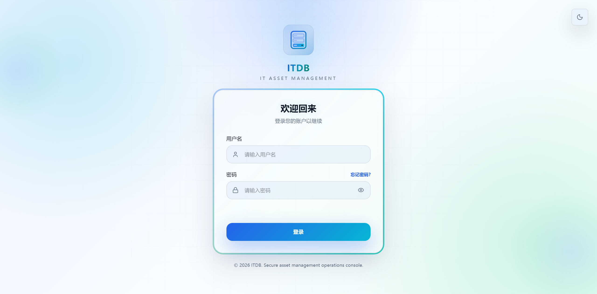
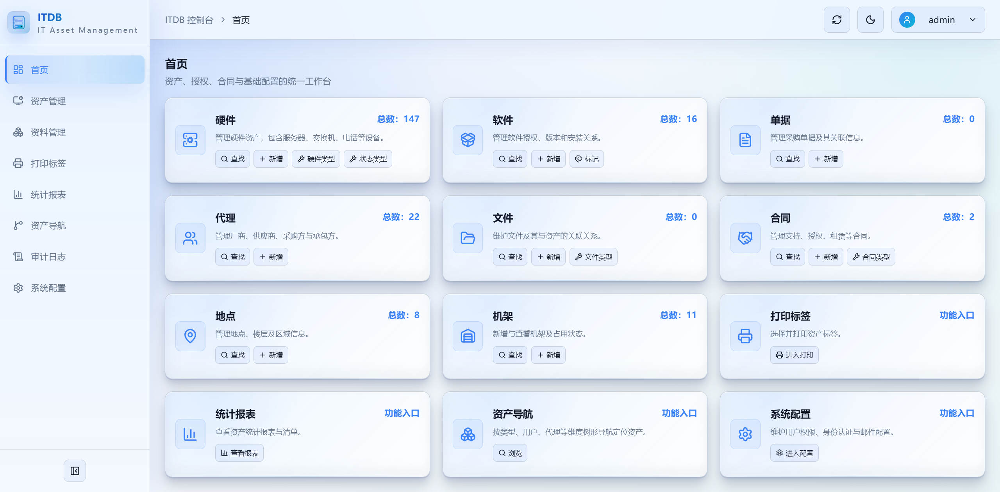

<div align="center">

<h1>ITDB</h1>

<p><b>IT 资产全生命周期管理平台</b> — 硬件 · 软件 · 单据 · 代理 · 文件 · 合同 · 地点 · 机架</p>

<p><b>简体中文</b> · <a href="README.en.md">English</a></p>

机房台账、维保到期、软件授权、合同续签，通常散在好几份 Excel 和共享盘里。  
ITDB 把它们收进一套**自托管**的系统：Go 后端 + React 控制台 + 单文件 SQLite。  
一台机器、一条 `docker run`，或一个从 Release 下载的二进制，就能跑起来。  
台账、附件与备份都落在你自己的磁盘上；仓库里没有 Token、没有密码、没有真实主机名。

<p>
  <a href="LICENSE"></a>
  <a href="https://go.dev/"></a>
  <a href="https://react.dev/"></a>
  <a href="https://www.sqlite.org/"></a>
  
</p>

<p>
  <b><a href="#项目预览">项目预览</a></b> ·
  <a href="#它做什么">它做什么</a> ·
  <a href="#怎么工作">怎么工作</a> ·
  <a href="#技术栈">技术栈</a> ·
  <a href="#快速开始">快速开始</a> ·
  <a href="#部署">部署</a> ·
  <a href="#权限模型">权限</a> ·
  <a href="#数据与安全">安全</a> ·
  <a href="#常见问题">常见问题</a> ·
  <a href="#项目结构">项目结构</a> ·
  <a href="#文档">文档</a>
</p>

</div>

---

ITDB 由 [zyx3721/itdb](https://github.com/zyx3721/itdb/) 全面重写而来：保留原有资产业务模型与旧库兼容导入，换成 Go + React 的前后端分离架构，并重做权限、审计、备份与标签打印。后端使用纯 Go 的 SQLite 驱动，**不需要 CGO、不需要 GCC、不需要外部数据库**；前端是 React 19 控制台，构建后由 Nitro 提供 SSR。

## 项目预览

### 登录

内部系统，没有公开注册。支持本地密码、AD/LDAP 与企业微信扫码登录，找回密码走图形验证码 + 邮箱验证码。



### 首页

仪表盘只读汇总：资产总数、状态分布与最近操作。侧栏按登录用户的权限逐项显示或隐藏，无权操作不会出现在界面上。



## 它做什么

- **资产全生命周期** — 硬件、软件、单据、代理、文件、合同、地点、机架八类资源。硬件含序列号、网络信息、维保与成本记录，并可关联软件、单据、合同、文件与内部硬件；合同支持类型/子类型、续签与事件历史；地点支持平面图上传与区域热区标注；机架支持 U 位与正反面可视化。
- **资料字典** — 硬件类型、合同类型（含子类型）、状态类型（自定义颜色）、文件类型、所属部门、标记六类字典，支持 Excel 模板下载、批量导入与导出；内置数据受编号与名称双重保护。
- **用户与权限** — 本地密码、AD/LDAP 与企业微信扫码登录、JWT 会话、找回密码邮件流程、企微账号绑定；内置 `admin` / `operator` / `viewer` 三角色，自定义角色可从 44 项权限中勾选，并支持用户组批量授权。前端隐藏无权入口，后端逐接口校验。
- **审计日志** — 登录注销、资产增删改、字典维护、系统配置、备份导入、标签打印等操作，按模块、操作、目标、结果与详情全量记录，支持搜索、筛选与导出；无实际修改的保存不写日志，业务规则拒绝不产生失败噪音。
- **备份与迁移** — 手动备份可勾选「按数据库实际引用的文件一并打包」；定时备份按五段 Cron 计划执行并按保留天数自动清理；导入支持 `.db` 与 `.zip`，兼容旧项目数据库自动转换。
- **标签打印** — QR 码标签设计器与多种标签纸预设，支持批量预览与打印。
- **统计与导航** — 仪表盘资产概览、内置统计报表（支持导出 XLSX/XLS/CSV/TXT）、按类型/部门/用户/代理多维度的资产导航树。
- **系统配置** — 品牌标识、找回密码安全时效、定时备份参数、用户/用户组/角色、AD/LDAP 与企业微信认证、邮件通知，并提供认证连通性与邮件发送测试。

**它不是** CMDB 自动发现工具，也不是监控平台：ITDB 管的是「台账 + 合同 + 授权 + 位置」，不做网络扫描，不采集指标，不主动登录被管设备。

同一个机房台账，放在两种做法里大致是这样：

| 现场 | Excel + 共享盘 | 用 ITDB |
| --- | --- | --- |
| 新增设备 | 谁都能改，版本靠文件名区分 | 有权限的人改，改动进审计日志 |
| 谁改的 | 无据可查 | 按模块/操作/目标/结果全量留痕 |
| 维保到期 | 靠自己记得 | 硬件维保与合同到期字段集中查看 |
| 软件授权 | 授权数与装机数对不上 | 按资产关联统计授权占用，超限直接拒绝 |
| 机柜位置 | 画在图里，图会过期 | U 位与正反面视图，位置冲突直接拒绝 |
| 权限 | 文件夹权限一把梭 | 44 项权限逐接口校验 |
| 换机器迁移 | 拷目录还要理公式 | 拷 `itdb.db` + `data/files` 即可 |

## 怎么工作

```text
        浏览器
           │  http
           ▼
  ┌──────────────────────────────────────┐
  │  Nginx（容器内或宿主机）                 │
  │  /assets/ · /       → 前端 SSR         │
  │  /api/ · /swagger/  → Go 后端          │
  └──────────────────────────────────────┘
        │                        │
        ▼                        ▼
  React 19 控制台            Go 1.25 后端
  Nitro SSR :5173            chi :8080
                                 │
                        ┌────────┴─────────┐
                        ▼                  ▼
                data/itdb.db         data/files
                49 张表              上传的附件
```

- **谁负责什么** — 控制台读取数据库当前状态展示资产与统计；资产增删改、系统配置、备份与导入等变更由后端执行权限校验并写入审计记录。
- **数据放哪** — SQLite 单文件数据库是业务数据的事实来源，上传文件保存在 `data/files`，备份输出到 `data/backups`，运行日志在 `data/logs`。
- **敏感信息** — JWT 签名密钥持久化在 `system_secrets` 表，LDAP 绑定密码以主密钥加密后落库，接口返回时脱敏。
- **对外暴露** — 只有健康检查、登录、品牌信息与找回密码流程接口可匿名访问，其余接口一律要求 `Authorization: Bearer <token>`。

## 技术栈

| 层 | 选型 |
| --- | --- |
| 后端语言 | Go 1.25+ |
| HTTP 路由 | [go-chi/chi](https://github.com/go-chi/chi) v5 |
| 数据库 | SQLite（[modernc.org/sqlite](https://gitlab.com/cznic/sqlite) 纯 Go 驱动，无 CGO） |
| 认证与加密 | JWT（golang-jwt/v5）、AD/LDAP（go-ldap/ldap v3）、企业微信 OAuth 扫码登录、bcrypt 口令散列、AES 敏感配置加密 |
| 导出与检索 | [excelize](https://github.com/qax-os/excelize) v2、mozillazg/go-pinyin |
| API 文档 | swag + http-swagger（Swagger UI） |
| 前端框架 | React 19 + TanStack Start / Router / Query |
| 语言与构建 | TypeScript 5 + Vite 7 + Nitro |
| 样式与组件 | Tailwind CSS v4、Radix UI、lucide-react、sonner |
| 图表与二维码 | Recharts、qrcode |
| 运行时打包 | Docker（Nginx + Supervisor 多进程） |

## 快速开始

本地开发需要 **Go 1.25+** 与 **Node.js 20+**。

```bash
git clone https://github.com/zyx3721/itdb-new.git
cd itdb-new
```

**后端**

```bash
cd backend
go mod download
cp .env.example .env      # 按需修改监听地址与密钥
go run cmd/server/main.go
```

后端默认监听 `http://localhost:8080`，首次启动自动创建数据库与默认管理员 `admin / admin123`。

**前端**（另开一个终端）

```bash
cd frontend
npm install
npm run dev
```

前端默认运行在 `http://localhost:5173`，开发服务器会把 `/api` 反向代理到 `http://127.0.0.1:8080`（可用 `frontend/.env` 中的 `VITE_API_BASE_URL` 覆盖）。

打开 `http://localhost:5173`，使用 `admin / admin123` 登录，**登录后立刻改密码**。Swagger 在 `http://localhost:8080/swagger/index.html`。

## 部署

只保留两种方式：**Docker 部署**（推荐）与 **Release 二进制部署**。源码编译与 systemd 直跑的完整过程见 [《完整手册》第四章](docs/manual.md)。

### 方式一：Docker 部署

镜像内置 Go 后端、Nginx 与前端 Nitro SSR，由 Supervisor 管理多进程，对外只暴露 80 端口。无需拉取仓库，一条命令即可拉起（记得把 `ITDB_JWT_SECRET` 换成足够随机的长字符串）：

```bash
docker run -d \
  --name itdb \
  --restart unless-stopped \
  -p 80:80 \
  -e ITDB_JWT_SECRET=请替换为足够随机的长字符串 \
  -e ITDB_HISTORY_LIMIT=1000 \
  -e ITDB_CORS_ORIGINS=* \
  -v "$(pwd)/data:/app/data" \
  registry.cn-shenzhen.aliyuncs.com/zyx3721/itdb-new:latest
```

> Windows PowerShell 下把 `-v "$(pwd)/data:/app/data"` 换成 `-v "${PWD}/data:/app/data"`。

启动后会在当前目录自动创建 `data/` 并挂载到容器内 `/app/data`：

```text
data/
├── itdb.db      # SQLite 数据库（首次启动自动创建）
├── files/       # 上传的附件
├── backups/     # 手动与定时备份
└── logs/        # 后端与前端运行日志
```

可用环境变量：

| 变量 | 默认值 | 说明 |
| --- | --- | --- |
| `ITDB_JWT_SECRET` | 空 | JWT 签名密钥；留空则首次启动自动生成随机密钥并持久化到数据库，建议显式设置 |
| `ITDB_HISTORY_LIMIT` | `1000` | 操作历史保留条数 |
| `ITDB_CORS_ORIGINS` | `*` | 允许的跨域来源，多个用逗号分隔 |
| `ITDB_SERVER_ADDR` | `127.0.0.1:8080` | 后端监听地址，容器内由 Nginx 反代，保持默认即可 |
| `ITDB_DB_PATH` | `data/itdb.db` | SQLite 数据库路径，相对容器内 `/app` 目录 |
| `ITDB_UPLOAD_DIR` | `data/files` | 上传文件存储目录，相对容器内 `/app` 目录 |

想改用本地构建的镜像，`deploy/Dockerfile` 需要仓库源码：

```bash
git clone https://github.com/zyx3721/itdb-new.git && cd itdb-new/deploy
docker build -f Dockerfile -t itdb-new:latest --build-arg ALPINE_MIRROR=mirrors.aliyun.com ..
```

然后把上面命令末尾的镜像名换成 `itdb-new:latest` 重新创建容器。

服务管理：

```bash
docker ps --filter name=itdb        # 查看运行状态
docker logs -f itdb                 # 查看实时日志
docker restart itdb                 # 重启容器
docker stop itdb                    # 停止
docker stop itdb && docker rm itdb  # 停止并删除容器（数据保留在当前目录 data/）

# 升级到新镜像：拉取后，用开头那条 docker run 重新创建容器
docker pull registry.cn-shenzhen.aliyuncs.com/zyx3721/itdb-new:latest
```

**访问**

- 控制台：`http://your-host/`，默认账号 `admin / admin123`
- 接口文档：`http://your-host/swagger/index.html`
- 健康检查：`http://your-host/health`

需要在宿主机上统一做域名、HTTPS 或多站点入口时，把端口映射改成非 80 端口（即 `-p 80:80` 改为 `-p 8080:80`），再由宿主机 Nginx 反代到容器。完整示例见 [《完整手册》3.7 节](docs/manual.md)。

### 方式二：Release 二进制部署

前往 [GitHub Releases](https://github.com/zyx3721/itdb-new/releases) 页面，按自己的操作系统与 CPU 架构下载对应压缩包，再按下面步骤校验、解压、配置、启动。

**下载哪个包**

| 你的机器 | 下载文件 |
| --- | --- |
| Linux x86_64 | `itdb_<版本>_linux_amd64.tar.gz` |
| Linux ARM64（鲲鹏、飞腾等） | `itdb_<版本>_linux_arm64.tar.gz` |
| macOS Intel 芯片 | `itdb_<版本>_darwin_amd64.tar.gz` |
| macOS Apple 芯片 | `itdb_<版本>_darwin_arm64.tar.gz` |
| Windows x86_64 | `itdb_<版本>_windows_amd64.zip` |
| Windows ARM64 | `itdb_<版本>_windows_arm64.zip` |
| 前端界面（以上任意平台都需要） | `itdb-frontend_<版本>.tar.gz` |
| 校验和 | `SHA256SUMS` |

后端包内是 `itdb` 可执行文件（Windows 为 `itdb.exe`）、`.env.example` 与 `README.txt`；前端包内是 Nitro SSR 的 `.output` 产物。二进制无外部运行时依赖，下载后可直接运行；前端 SSR 需要目标机器上安装 Node.js。

**1. 校验下载**

```bash
VERSION=1.0.0
mkdir -p /data/itdb && cd /data/itdb
sha256sum -c SHA256SUMS
```

**2. 解压**

```bash
mkdir -p backend frontend/.output
tar -xzf itdb_${VERSION}_linux_amd64.tar.gz -C backend --strip-components=1
tar -xzf itdb-frontend_${VERSION}.tar.gz -C frontend/.output
```

得到的目录结构：

```text
/data/itdb/
├── backend/
│   ├── itdb            # 后端二进制
│   ├── .env.example
│   └── data/           # 首次启动后生成：itdb.db 与 files/
└── frontend/
    └── .output/
        ├── public/     # 浏览器静态资源
        └── server/
            └── index.mjs   # Nitro SSR 入口
```

**3. 配置并启动后端**

```bash
cd /data/itdb/backend
cp .env.example .env
vim .env               # 至少设置 ITDB_JWT_SECRET
./itdb
```

后端默认监听 `127.0.0.1:8080`，并在当前目录下创建 `data/itdb.db` 与 `data/files`。需要常驻时交给 systemd：

```ini
# /etc/systemd/system/itdb-backend.service
[Unit]
Description=ITDB Backend
After=network.target

[Service]
Type=simple
WorkingDirectory=/data/itdb/backend
ExecStart=/data/itdb/backend/itdb
Restart=on-failure
RestartSec=5

[Install]
WantedBy=multi-user.target
```

```bash
systemctl daemon-reload && systemctl enable --now itdb-backend
```

**4. 启动前端 SSR**

```bash
cd /data/itdb/frontend
HOST=127.0.0.1 PORT=5173 node .output/server/index.mjs
```

**5. 用 Nginx 收口**

```nginx
server {
    listen 80;
    server_name your-domain.com;
    client_max_body_size 500m;

    # /assets/ 亦是资产模块页面路由前缀，仅按扩展名接管静态构建产物
    location ~* ^/assets/.+\.(js|mjs|css|map|json|svg|png|jpe?g|gif|webp|ico|woff2?|ttf)$ {
        root /data/itdb/frontend/.output/public;
        try_files $uri =404;
        expires 1y;
        add_header Cache-Control "public, immutable";
    }

    location /api/ {
        proxy_pass http://127.0.0.1:8080;
        proxy_set_header Host $host;
        proxy_set_header X-Real-IP $remote_addr;
        proxy_set_header X-Forwarded-For $proxy_add_x_forwarded_for;
        proxy_set_header X-Forwarded-Proto $scheme;
        proxy_read_timeout 600s;
    }

    location /swagger/ {
        proxy_pass http://127.0.0.1:8080;
        proxy_set_header Host $host;
    }

    location = /health {
        proxy_pass http://127.0.0.1:8080/api/health;
    }

    location / {
        proxy_pass http://127.0.0.1:5173;
        proxy_set_header Host $host;
        proxy_set_header X-Real-IP $remote_addr;
        proxy_set_header X-Forwarded-For $proxy_add_x_forwarded_for;
        proxy_set_header X-Forwarded-Proto $scheme;
    }
}
```

前端必须经 `node .output/server/index.mjs` 提供 SSR；**只把 `.output/public` 配成静态根目录会导致服务端渲染页面无法返回**。含 HTTPS 与 80→443 跳转的完整示例见 [《完整手册》4.4 节](docs/manual.md)。

**6. 访问**

同 Docker 方式：控制台 `http://your-domain.com`（`admin / admin123`）、接口文档 `/swagger/index.html`、健康检查 `/health`。

## 权限模型

接口按角色权限逐个校验，无权限返回 403；`admin` 用户（`usertype=0`）拥有全部权限。权限 Key 形如 `模块.资源.操作`，共 44 项。

| 身份 | 默认权限 |
| --- | --- |
| 默认管理员 `admin` | 全部 44 项；不可改名、禁用或删除 |
| 内置角色 `admin` | 全部 44 项 |
| 内置角色 `operator` | 八类资产与六类字典的查看 + 管理、标签三项、报表查看与导出、导航/审计查看、系统设置四项查看；不含任何系统设置的修改权限 |
| 内置角色 `viewer` | 全部只读：八类资产、六类字典、标签预览、报表、导航、审计与系统设置查看 |
| 自定义角色 / 用户组 | 从 44 项中勾选；勾选任一 `manage` 会自动补全其对应的 `read` |

按模块划分：

- **资产管理** — `assets.{items|software|invoices|agents|files|contracts|locations|racks}.read` / `.manage`
- **资料管理** — `dictionaries.{itemtypes|contracttypes|statustypes|filetypes|dpttypes|tags}.read` / `.manage`
- **打印标签** — `labels.preview`（预览）、`labels.print`（打印，隐含预览）、`labels.manage`（预设维护，隐含预览）
- **统计报表** — `reports.read`（查看）、`reports.manage`（导出，隐含查看）；**资产导航** — `browse.read`
- **审计日志** — `audit.read`（查看）、`audit.manage`（导出，隐含查看）
- **系统设置** — `settings.{base|users|auth|notifications}.read` / `.manage`；数据库备份下载与导入要求 `settings.base.manage`
- **聚合接口** — `GET /api/bootstrap`、`GET /api/dashboard/summary` 要求持有任一只读类权限

## 数据与安全

```text
控制台账号登录后台、改配置、管资产
        +
Bearer Token 逐接口校验 44 项权限，无权限 403
        +
JWT 密钥与 LDAP 绑定密码加密落库，接口回显脱敏
        +
仓库禁止提交 Token / 密码 / 真实主机名 / 客户名
```

- **先改默认密码** — 首次部署后立即修改 `admin` 的默认口令。
- **显式设置 JWT 密钥** — 不设置时系统会自动生成随机密钥并持久化（删库即全体会话失效）；多实例部署必须显式设置 `ITDB_JWT_SECRET`。
- **启用 HTTPS** — 生产环境通过 Nginx 配置证书，参考 [《完整手册》4.4.2 节](docs/manual.md)。
- **收紧跨域** — 生产环境按需配置 `ITDB_CORS_ORIGINS`，不要保留 `*`。
- **限制来源** — 通过 Nginx 或防火墙限定访问 IP 范围。
- **保护数据目录** — `data/` 内含数据库、附件与备份，目录权限只授予运行服务的账号；`.env` 已在 `.gitignore` 中排除。
- **异地备份** — 系统内置定时备份之外，建议再加一层异地副本。

## API 文档

后端集成 Swagger/OpenAPI，启动后即可查看在线接口文档：

- **Swagger UI**：`http://localhost:8080/swagger/index.html`
- **OpenAPI JSON**：`http://localhost:8080/swagger/doc.json`
- **健康检查**：`GET /health`、`GET /api/health`

无需认证的接口只有：`POST /api/auth/login`、`GET /api/auth/providers`、`GET /api/auth/wecom/authorize`、`POST /api/auth/wecom/callback`、`GET /api/auth/password-reset/captcha`、`POST /api/auth/password-reset/verify`、`POST /api/auth/password-reset/send`、`POST /api/auth/password-reset/confirm`、`GET /api/public/base`、`GET /health`、`GET /api/health`；其余接口均需在请求头携带 `Authorization: Bearer <token>`。

登录请求示例：

```json
{
  "username": "admin",
  "password": "admin123",
  "mode": "local"
}
```

按模块分组的完整接口清单（认证、代理、硬件、软件、单据、合同、文件、地点、机架、字典、标签、报表、浏览、审计、备份、导入、系统设置）见 [《完整手册》第五章](docs/manual.md)。

修改接口后，在 `backend/` 目录执行以下命令同步 Swagger 产物：

```bash
swag init -g cmd/server/main.go -o docs
```

## 数据库

SQLite 单文件数据库，默认路径 `backend/data/itdb.db`，共 49 张表（36 张随初始化创建、13 张由系统配置模块按需创建）。

| 分组 | 表 |
| --- | --- |
| 核心业务 | `items`、`software`、`contracts`、`invoices`、`files`、`agents`、`users`、`locations`、`racks`、`locareas`、`labelpapers`、`tags`、`actions`、`contractevents` |
| 关联关系 | `item2inv`、`item2soft`、`item2file`、`itemlink`、`contract2item`、`contract2soft`、`contract2inv`、`contract2file`、`invoice2file`、`soft2inv`、`software2file`、`tag2item`、`tag2software` |
| 资料字典 | `itemtypes`、`contracttypes`、`contractsubtypes`、`dpttypes`、`statustypes`、`filetypes` |
| 系统与配置 | `settings`、`system_secrets`、`history`、`settings_base`、`settings_email`、`settings_auth_providers`、`settings_roles`、`settings_role_status`、`settings_user_profiles`、`settings_user_groups`、`settings_user_group_members`、`settings_user_group_roles`、`settings_user_roles` |
| 找回密码 | `password_reset_captchas`、`password_reset_requests`、`password_reset_send_log` |

每张表的字段与用途见 [《完整手册》第六章](docs/manual.md)。

## 常见问题

**忘记管理员密码怎么办？**

停掉后端，直接改数据库即可（推荐，不丢数据）：

```bash
sqlite3 backend/data/itdb.db "UPDATE users SET pass = 'admin123' WHERE username = 'admin';"
```

重启后后端会自动把明文口令升级为 bcrypt 存储。

**JWT 有效期多久？**

48 小时，签发时写死在 `backend/internal/service/auth_workflow.go`；需要调整时改该处的 `48 * time.Hour` 并重新编译。

**数据库能直接拷走迁移吗？**

可以。SQLite 是单文件数据库，停服后复制 `itdb.db` 与 `data/files` 即可；也可以走系统内置的数据库导入功能在线替换。

**怎么从旧版 PHP ITDB 迁移？**

「系统配置 → 数据备份 → 数据库导入」上传旧库 `.db` 或含附件的 `.zip`，系统会识别旧结构并自动转换：只迁移资产管理与资料管理数据（硬件维护日志不迁移），用户按用户名与当前系统合并（已有同名用户保留现状，新导入用户自动关联 admin 或 viewer 内置角色），系统配置（基础、认证、通知等）、用户角色档案与审计日志保持当前系统不变；导入前会自动预备份（当前库引用的上传文件一并打包为 zip），导入成功后清理已打包的上传文件，当前数据库文件被外部工具占用时会提示先关闭再导入。更多细节见 [《完整手册》7.4 节](docs/manual.md)。

**怎么启用 LDAP 登录？**

第一步在「系统配置 → 认证配置」填好 LDAP 连接参数并启用；第二步在「用户管理」中创建与 LDAP `sAMAccountName` 同名的用户。本地用户表中不存在该用户名时，即使 LDAP 密码正确也无法登录。

**怎么启用企业微信扫码登录？**

在企业微信管理后台「应用管理」创建自建应用，记录 AgentID 与 Secret；在应用的「网页授权及 JS-SDK」中将本系统访问域名配置为可信回调域名，并在「企业可信 IP」中加入本服务出口 IP。再到「系统配置 → 认证配置 → 企业微信」填写企业 ID（corpid）、AgentID、Secret 并启用（回调地址前缀可留空，按当前访问地址自动推断）。用户先用账号密码登录，在右上角菜单「绑定企微」扫码完成账号关联，之后即可在登录页选择企业微信扫码登录。

**自动备份存在哪里？**

`data/backups/`。未引用上传文件时为 `itdb-YYYYMMDD-HHMMSS.db`；引用到附件时打包为同名 `.zip`（数据库在包根目录，附件在包内 `files` 目录），过期文件按保留天数自动清理。是否启用与 Cron 计划在「系统配置 → 基础配置 → 数据备份」。

**上传文件有大小限制吗？**

后端默认不限制；使用 Nginx 反代时需设置 `client_max_body_size`（示例中为 500m）。

**为什么前端构建后不能只配静态目录？**

因为控制台是 TanStack Start + Nitro 的 SSR 应用，页面由 `node .output/server/index.mjs` 返回，静态目录只提供 `/assets/` 等资源。

其余问题见 [《完整手册》第七章](docs/manual.md)。

## 项目结构

```text
itdb/
├── backend/                 Go 后端服务
│   ├── cmd/server/          服务入口
│   ├── config/              环境变量与运行配置加载
│   ├── docs/                Swagger/OpenAPI 生成产物
│   ├── internal/            领域模型、数据仓储、业务编排与安全能力
│   ├── pkg/database/        SQLite 连接与行转换基础设施
│   ├── router/              HTTP 路由装配、全局中间件、权限校验与 Swagger 注解
│   │   ├── assets/          资产域接口（硬件/软件/单据/代理/文件/合同/地点/机架/字典/标记/报表/浏览）
│   │   ├── auth/            认证域接口（登录、找回密码、改密、用户管理）
│   │   ├── common/          响应输出、上下文认证、文件上传与数据库初始化等公共能力
│   │   ├── settings/        系统配置域接口（基础配置、用户/角色/群组、认证与邮件）
│   │   └── system/          系统域接口（数据库备份、导入与审计历史）
│   ├── data/                SQLite 数据库、上传文件与备份目录（运行时生成）
│   └── .env.example         环境变量模板
├── deploy/                  Docker 镜像构建与编排文件
├── docs/                    完整手册与英文文档
├── frontend/                React 控制台
│   └── src/
│       ├── components/      布局、启动页、弹窗与基础 UI 组件
│       ├── features/        认证、资产、审计、仪表盘、设置、工具等业务域组件
│       ├── lib/             会话认证、品牌配置、导出下载与通用工具
│       ├── routes/          TanStack Router 页面路由
│       ├── router.tsx       路由实例
│       ├── server.ts        服务端入口
│       ├── start.ts         客户端入口
│       └── styles.css       全局样式与主题变量
├── .github/                 GitHub Actions 工作流与预览图
├── .dockerignore            Docker 构建忽略规则
├── .gitignore               Git 忽略规则
├── LICENSE
├── README.md                中文说明（本文件）
├── README.en.md             English
└── docs/manual.md           完整手册（含全量接口清单、数据库表与部署细节）
```

## 文档

| 先看这个 | 再往下 |
| --- | --- |
| [快速开始](#快速开始) | 本地起后端与前端，默认账号与端口 |
| [部署](#部署) | Docker 与 Release 二进制两条路径、环境变量、反向代理 |
| [权限模型](#权限模型) | 44 项权限怎么分组、内置角色各有什么 |
| [完整手册](docs/manual.md) | 全量接口清单、49 张表字段、Nginx 与 HTTPS 示例、迁移与排障 |
| [English README](README.en.md) | 同样的内容，英文版 |

## 版本历史

| 版本 | 发布日期 | 更新日志 |
| --- | --- | --- |
| v1.1.2 | 2026-09-18 | [verchanglog/v1.1.2.md](verchanglog/v1.1.2.md) |
| v1.1.1 | 2026-09-18 | [verchanglog/v1.1.1.md](verchanglog/v1.1.1.md) |
| v1.1.0 | 2026-09-17 | [verchanglog/v1.1.0.md](verchanglog/v1.1.0.md) |
| v1.0.0 | 2026-09-17 | [verchanglog/v1.0.0.md](verchanglog/v1.0.0.md) |

各版本的构建产物与发布说明见 [GitHub Releases](https://github.com/zyx3721/itdb-new/releases)。

## 致谢

感谢以下开源项目与技术社区：

- [go-chi/chi](https://github.com/go-chi/chi) — 轻量高效的 Go HTTP 路由框架
- [modernc.org/sqlite](https://gitlab.com/cznic/sqlite) — 纯 Go 实现的 SQLite 驱动
- [swaggo/swag](https://github.com/swaggo/swag) — Swagger 文档生成工具
- [excelize](https://github.com/qax-os/excelize) — Excel 文件读写库
- [TanStack](https://tanstack.com/) — Router / Query / Start 前端框架套件
- [Tailwind CSS](https://tailwindcss.com/) — 原子化 CSS 框架

也感谢原项目 [zyx3721/itdb](https://github.com/zyx3721/itdb/) 打下的业务模型基础。

## 许可证

本项目采用 [MIT License](LICENSE) 开源协议，可自由使用、复制、修改、合并、发布、分发、再许可与销售，只需在所有副本或重要部分中保留版权声明与许可声明。

## 联系方式

- **Email**：416685476@qq.com
- **GitHub Issues**：[zyx3721/itdb-new/issues](https://github.com/zyx3721/itdb-new/issues)
- **项目主页**：[github.com/zyx3721/itdb-new](https://github.com/zyx3721/itdb-new)

---

**⭐ 如果这个项目对您有帮助，欢迎 Star 支持！**
